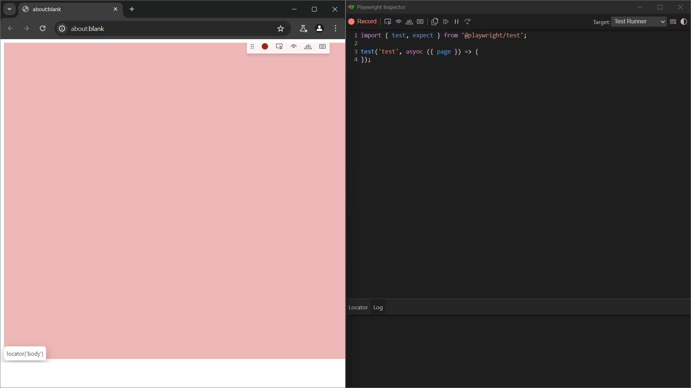
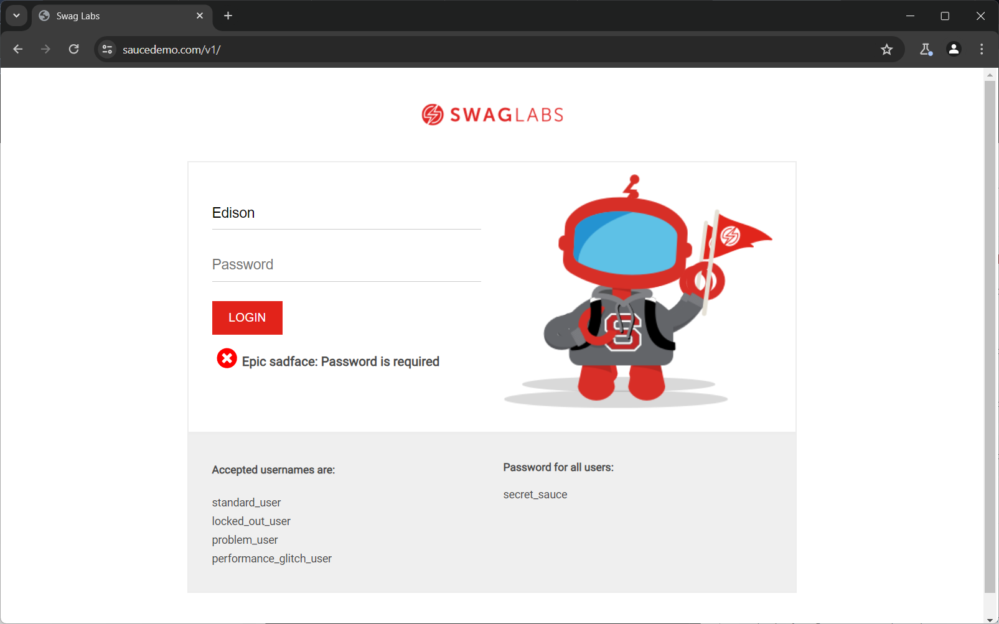
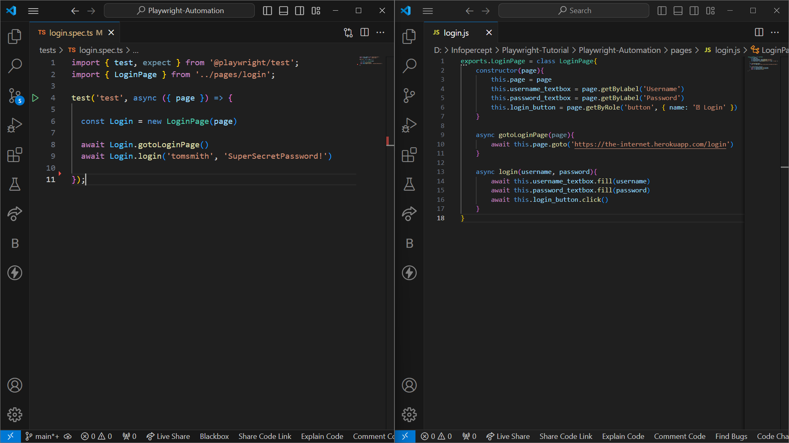
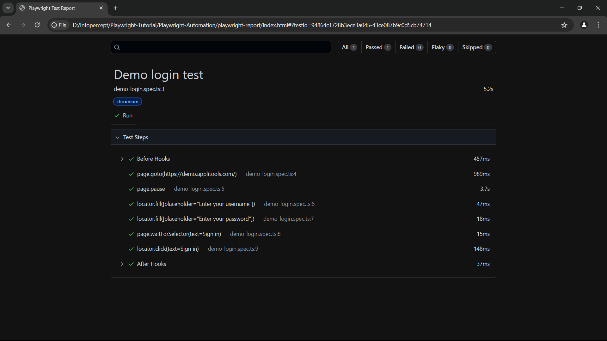

# Playwright Automation

## What is Playwright?

Playwright is an open-source automation library for browser testing and web scraping

Developed By Microsoft and launched on 31st Jan 2020

It runs test on 3 types of browsers, Chromium( Edge, Chrome, Brave etc), Firefox (all versions of firefox), Webkit (Safari).


## Installation

Install Playwright with npm

```bash
  npm install playwright@latest
```
    
## Tests

Playwright works on test blocks

Usually stored in tests folder

Tests can be written either in Javascript or Typescript

It can be chosen at the time on installation

An example test will already be provided in the test folder

```
import { test, expect } from '@playwright/test';

test('has title', async ({ page }) => {
  await page.goto('https://playwright.dev/');

  // Expect a title "to contain" a substring.
  await expect(page).toHaveTitle(/Playwright/);
});

test('get started link', async ({ page }) => {
  await page.goto('https://playwright.dev/');

  // Click the get started link.
  await page.getByRole('link', { name: 'Get started' }).click();

  // Expects page to have a heading with the name of Installation.
  await expect(page.getByRole('heading', { name: 'Installation' })).toBeVisible();
});

```
## How to run tests

Any test in the test folder can be executed individually or all the tests in the folder
```
npx playwright test
```
The above command executes all the tests in the test folder
```
npx playwright test example.spec.ts
```
The above command runs any specific test file

A single test file may contain multiple tests

## Structure

Since playwright is node library its code will be similar to js or ts

Firstly we import test modules from playwright
```
import { test } from '@playwright/test';
```
Next we create a test block

A test block is similar to a function which takes 2 arguments

First a string which is used to name that test block

Second a function

The second parameter will contain the test code
```
test('has title', async ({ page }) => {
    await page.goto('https://playwright.dev/');
    // Expect a title "to contain" a substring.
    await expect(page).toHaveTitle(/Playwright/);
});

```
This is an test block from the example.spec.ts file 

Here the name of test if has title

As the second parameter the function takes page fixture as a argument

This test will go to playwright.dev website and checks its title

We write async keyword to make this function asynchronous 

The await keyword will make the code wait till we resume it


## Making Tests

There are 2 ways to write a test code

1. Manually writing test:-  

We can always manually write test block code

While by this method we have complete control over the code, it 
can be very time consuming to write test code

2. Codegen

Codegen is playwrite’s software with gui which can write test code for us

To use codegen we type into terminal:-
```
npx playwright codegen
```
This will open a browser and a playwright inspector ui


## Headed and Headless mode

By default playwright uses headless mode meaning the browser will not be visible to us

To view the browser during execution we use headed mode

To use headed mode during execution we add to the command        `--headed`
```
npx playwright test example.spec.ts --headed
```

## Debug Mode

In debug mode we can use playwright inspector to control execution of test
    
    npx playwright test example.spec.ts --debug

## Execution Browser

Playwright supports Chromium, FIrefox and Webkit browsers

We can specify in which browser the test should execute by specifying it in the execution command
```
npx playwright test example.spec.ts --project chromium
```
```
npx playwright test example.spec.ts --project firefox
```
```
npx playwright test example.spec.ts --project webkit
```
## Workers

Worker are like threads

We can control the number of workers executing the test

    npx playwright test example.spec.ts --workers 2

## Assertions

Assertions is like if else statement

It checks the derived value from the expected value

To use assertions we use expect method

Firstly we need to import expect module from the playwright library
```
await expect(page.getByTestId('status')).toHaveText('Submitted');
```
## Annotations

There are 4 annotations
- .skip()
- .fixme()
- .only()
- .slow()

1. .skip()

The test with this annotation is skiped during execution
```
test.skip('skip this test', async ({ page }) => {
  // This test is not run
});
```
We can also skip a test conditionally 
```
test('skip this test', async ({ page, browserName }) => {
  test.skip(browserName === 'firefox', 'Still working on it');
});
```

2. .fixme()

Aborts the test with this annotation and marks it as to be solved
```
test.fixme('to be fixed', async ({ page }) => {
  // ...
});
```

3. only()

Only executes the test with this annotation
```
test.only('focus this test', async ({ page }) => {
  // Run only focused tests in the entire project.
});
```

4. .slow()

Triples timeout value
```
test('slow test', async ({ page }) => {
  test.slow();
  // ...
});
```
## Group

You can group tests to give them a logical name or to scope before/after hooks to the group.

Keyword describe is used to group tests
```
import { test, expect } from '@playwright/test';
    
test.describe('two tests', () => {
    test('one', async ({ page }) => {// ...});
    test('two', async ({ page }) => {// ...});
});
```


## Trace

Trace is a playwright gui which captures the tests in video format and can be used to debug test

We can configure trace to run as on, off, retain-on-failure, on-first-entry, on-all-retries.

## API testing

We can use playwright to test api requests like get, put, post and delete

For this we need to use request fixture as argument to the function

playwright.config.ts:

```
import { defineConfig } from '@playwright/test';
export default defineConfig({
  use: {
    // All requests we send go to this API endpoint.
    baseURL: 'https://api.github.com',
    extraHTTPHeaders: {
      // We set this header per GitHub guidelines.
      'Accept': 'application/vnd.github.v3+json',
      // Add authorization token to all requests.
      // Assuming personal access token available in the environment.
      'Authorization': `token ${process.env.API_TOKEN}`,
    },
  }
});
```
Writing tests:
```
const REPO = 'test-repo-1';
const USER = 'github-username';

test('should create a bug report', async ({ request }) => {
  const newIssue = await request.post(`/repos/${USER}/${REPO}/issues`, {
    data: {
      title: '[Bug] report 1',
      body: 'Bug description',
    }
  });
  expect(newIssue.ok()).toBeTruthy();

  const issues = await request.get(`/repos/${USER}/${REPO}/issues`);
  expect(issues.ok()).toBeTruthy();
  expect(await issues.json()).toContainEqual(expect.objectContaining({
    title: '[Bug] report 1',
    body: 'Bug description'
  }));
});

test('should create a feature request', async ({ request }) => {
  const newIssue = await request.post(`/repos/${USER}/${REPO}/issues`, {
    data: {
      title: '[Feature] request 1',
      body: 'Feature description',
    }
  });
  expect(newIssue.ok()).toBeTruthy();

  const issues = await request.get(`/repos/${USER}/${REPO}/issues`);
  expect(issues.ok()).toBeTruthy();
  expect(await issues.json()).toContainEqual(expect.objectContaining({
    title: '[Feature] request 1',
    body: 'Feature description'
  }));
});
```
## Page Object Model

Large test suites can be structured to optimize ease of authoring and maintenance. 

Page object models are one such approach to structure your test suite.

A page object represents a part of your web application.

An e-commerce web application might have a home page, a listings page and a checkout page. Each of them can be 


## HTML Report

Playwright provides support to display test result in a HTML format

Add a reporter as HTML in the `playwright.config.ts`

```
reporter: 'html'
```
The output will stored in folder named playwright-report
